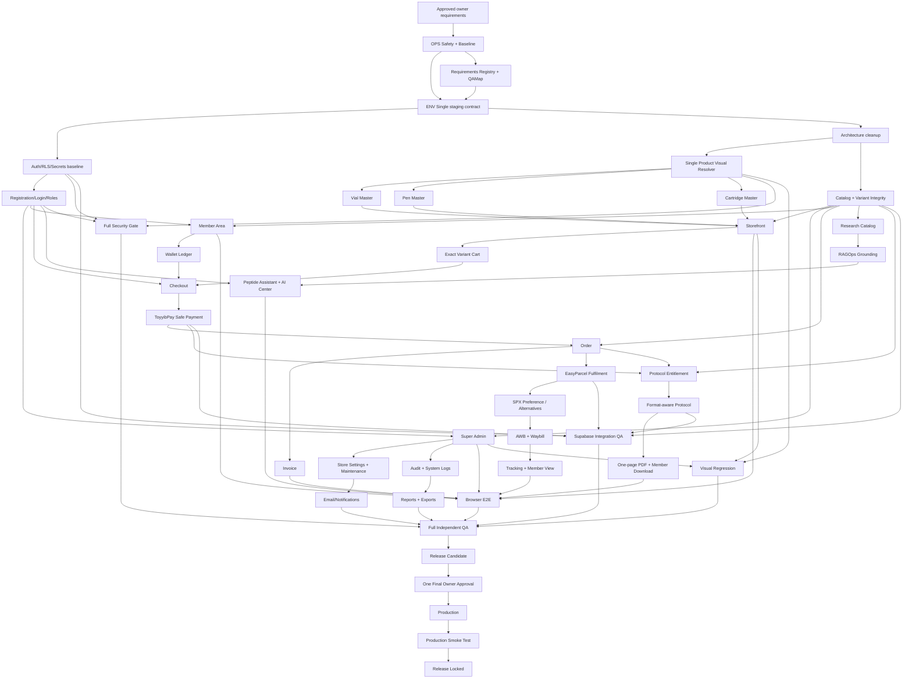
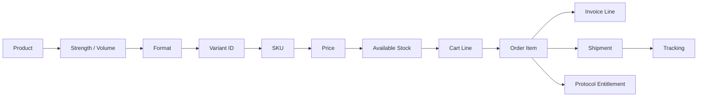
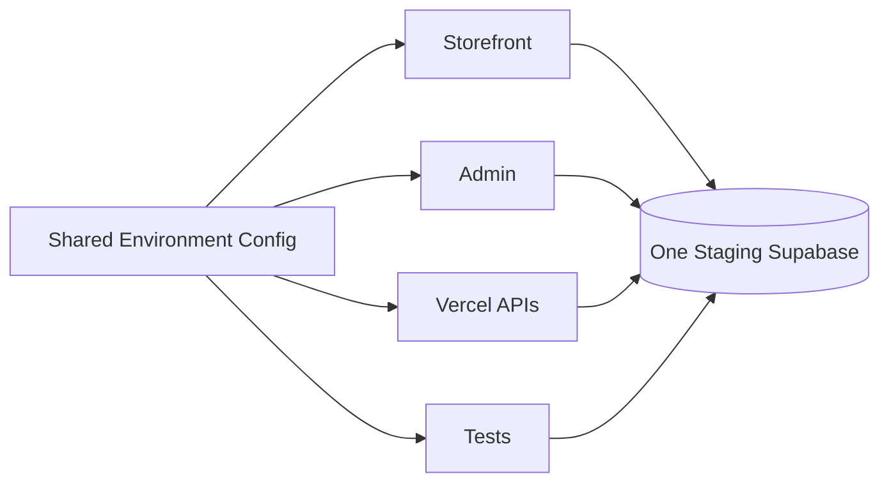

# AI BioTech Master Build Dependency Graph

This graph is the Graph Mode contract. A downstream work package cannot be marked `PASS` while a required upstream node is `FAIL`, `BLOCKED`, `NOT TESTED` or `NEEDS OWNER`.

## Exact identity chain

## Environment contract chain

## Gate rules

1. `REQ-OPS-001..005` gate all structural/destructive work.
2. `REQ-ENV-001..005` must pass before Admin, Auth, payment, shipping or protocol writes are trusted.
3. `REQ-VIS-001` gates Vial, Pen, Cartridge and all storefront visual assertions.
4. `REQ-CAT-001/002` gate cart, order, invoice, shipment and protocol entitlement.
5. `REQ-AUTH-002/006` gate Admin, Member, wallet, invoice, shipment and protocol private data.
6. `REQ-PAY-001` gates valid order creation in payment flows.
7. `REQ-ORD-001/002` gate invoice, EasyParcel/SPX and protocol entitlement.
8. `REQ-SHIP-007/008` gate the `Shipped` order state.
9. `REQ-PRO-001..003` gate member protocol download.
10. `REQ-SEC-001..005` must pass before full QA can pass.
11. `REQ-QA-001..010` must pass before a release candidate is frozen.
12. Production is unreachable until `REQ-REL-004` records explicit final owner approval.
13. A Vercel `READY` state is deployment evidence only and never bypasses these gates.