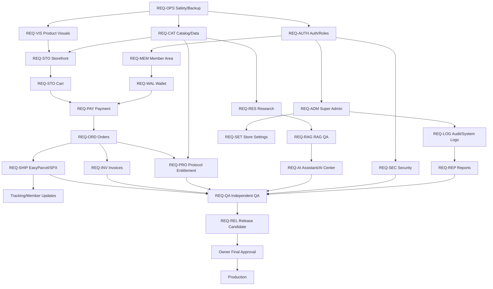

# AI BioTech Master Build Dependency Graph

## Gate Rules

1. A downstream requirement cannot be marked PASS if a required upstream dependency is FAIL/BLOCKED.
2. `REQ-OPS-001/002` gate all structural or destructive changes.
3. `REQ-CAT-001` gates storefront variant behavior, order integrity and protocol entitlement.
4. `REQ-AUTH-002` gates Admin, Member private data and Security.
5. `REQ-ORD-001` gates Invoice, Shipping and Protocol entitlement.
6. `REQ-QA-001` must pass before `REQ-REL-001` can request owner approval.
7. Production is unreachable until owner approval of the frozen release candidate.
